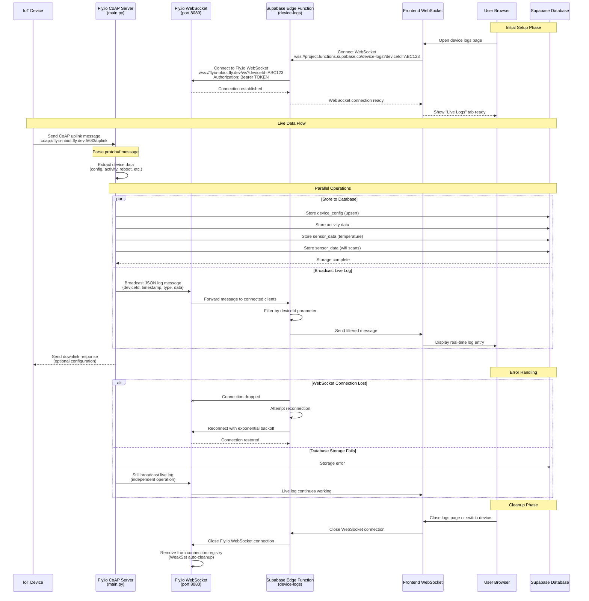

# Live Log Streaming Sequence Diagram

## Mermaid Sequence Diagram (Copy & Paste)



## Alternative Text-Based Flow Diagram

```
┌─────────────┐    CoAP     ┌──────────────────┐    Store Data    ┌─────────────────┐
│ IoT Device  │────────────▶│  Fly.io Server   │─────────────────▶│ Supabase DB     │
└─────────────┘             │  (main.py)       │                  └─────────────────┘
                             └──────────────────┘
                                       │
                                       │ Broadcast JSON
                                       ▼
                             ┌──────────────────┐
                             │ WebSocket        │
                             │ (/ws endpoint)   │
                             └──────────────────┘
                                       │
                                       │ Relay Message
                                       ▼
                             ┌──────────────────┐    Filter by     ┌─────────────────┐
                             │ Supabase Edge    │   deviceId      │ Frontend        │
                             │ Function         │────────────────▶│ WebSocket       │
                             │ (device-logs)    │                  └─────────────────┘
                             └──────────────────┘                           │
                                                                           │
                                                                           ▼
                                                                 ┌─────────────────┐
                                                                 │ User Browser    │
                                                                 │ (Live Logs Tab) │
                                                                 └─────────────────┘
```

## Message Flow Details

### 1. CoAP Uplink Processing
```json
// Input: Protobuf CoAP message
// Output: Parsed device data + WebSocket broadcast

{
  "deviceId": "ABC123",
  "timestamp": "2024-01-15T10:30:00.000Z",
  "type": "uplink",
  "message": "Received uplink #42",
  "data": {
    "uplink_count": 42,
    "temperature": 23.5,
    "activity": {
      "sleep": 3600,
      "modem": 45,
      "gnss": 120,
      "wifi": 30,
      "other": 60
    },
    "wifi_count": 3,
    "reboot": null
  }
}
```

### 2. Database Storage (Parallel)
```sql
-- device_config (upsert)
UPSERT INTO device_config (devid, heartbeat_interval, hw_version, ...)

-- activity (insert)
INSERT INTO activity (devid, uplink_count, sleep, modem, ...)

-- sensor_data (insert)
INSERT INTO sensor_data (devid, data_type, data)
VALUES ('ABC123', 'temperature', '{"temperature": 23.5}')
```

### 3. WebSocket Authentication
```http
GET wss://flyio-nbiot.fly.dev/ws?deviceId=ABC123
Authorization: Bearer your-secure-token
```

### 4. Error Recovery
- WebSocket disconnections trigger automatic reconnection
- Database failures don't affect live streaming
- Invalid device IDs are filtered out
- Token authentication prevents unauthorized access

## Performance Characteristics

- **Latency**: < 100ms from CoAP receipt to frontend display
- **Concurrency**: Handles multiple device connections simultaneously  
- **Memory**: WeakSet automatically cleans up closed connections
- **Reliability**: Database and live streaming operate independently

## Security Flow

```
[IoT Device] → [Fly.io:5683 UDP] → [Internal Processing] → [Fly.io:8080 WSS + Auth Token] → [Supabase Edge Function] → [Frontend WSS]
     │                                                              │
     └── No direct internet access to frontend ←────────────────────┘
```

The token-based authentication ensures only authorized Edge Functions can access the WebSocket stream, while the frontend connects through Supabase's secure infrastructure.